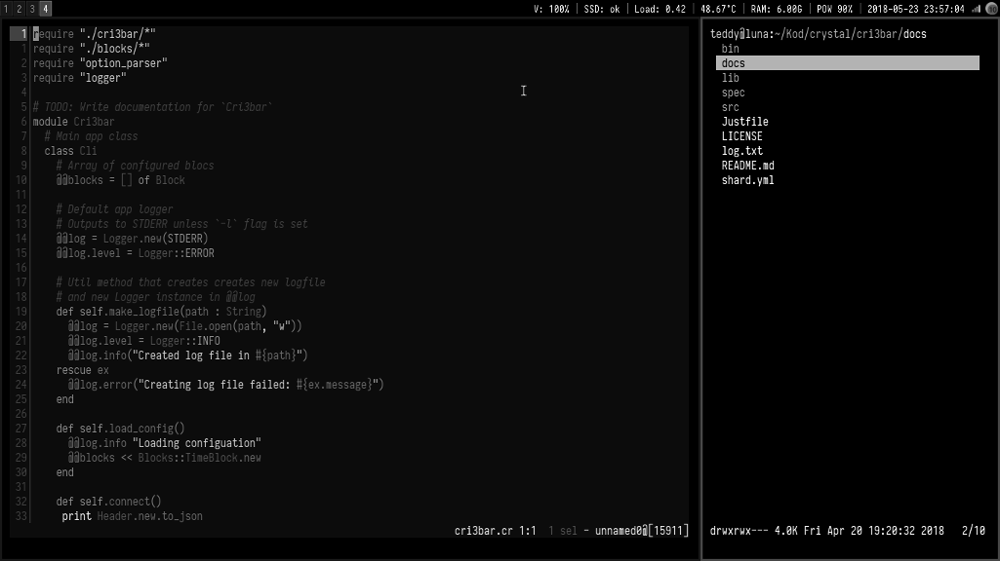

# Kakoune lf

kakoune-lf is plugin for [Kakoune] text editor. It integrates [lf file manager]
as sidebar file browser.



## Installation

You have to have lf executable in PATH.

### Dependencies

**Only last stable versions of Kakoune and lf are supported**

- [lf][lf] file manager

### Installation

1. Install Kakoune plugin. Any of the following methods will do

- use [plug.kak] plugin manager
- load `lf.kak` from your kakrc: `source path/to/lf.kak`
- put `lf.kak` in your autoloads directory `~/.config/kak/autoload/`

2. Add this snippet to lf config file: `~/.config/lf/lfrc`

```
# Kakoune integration

&{{
    if [ "$KAKLF" = "yes" ]; then
        echo "eval -client $kak_client set-option global lf_id %{$id}" | kak -p "$kak_session"
    fi
}}
```

## Usage

Open/close lf with `:lf` command.

Lf keys:
- up / down <kbd>j</kbd> <kbd>k</kbd>
- parent directory <kbd>h</kbd>
- open file under cursor (and selected files if any) in Kakoune <kbd>l</kbd>
- select file <kbd>space</kbd>
- unselect all files <kbd>u</kbd>
- quit <kbd>q</kbd>

See lf documentation for more.

## Options

- `lf_terminal_cmd` name of Kakoune command that will spawn terminal/tmux
  window with lf. It *must* expose `$kak_session` and `$kak_client`
  environmental variables.  It also must set variable `KAKLF` to `yes`. By
  default it uses `terminal` (build-in) command. See `lf-spawn-new` form
  `rc/lf.kak` for reference.


## TODO

Check out [GH project](https://github.com/TeddyDD/kakoune-lf/projects/)

## Changelog

- 0.1 2018-09-07:
    - initial release
    - Kakoune v2018.09.04
- 0.2 2019-02-02:
    - **Kakoune v2019.01.20**
    - **lf r9**
    - _CHANGE_ update README to new format
    - _CHANGE_ lf works as a toggle
    - __CHANGE__ reduce amount of configuration that has to be pasted in
    `lfrc` (**breaking** requires manual update of `lfrc`)
    - __CHANGE__ to new repository layout (**breaking** update path in
    `kakrc`)
    - _ADD_ `lf_terminal_cmd` option for custom spawn command
- 0.3 2019-02-07:
    - _CHANGE_ add hooks to `lf` group
    - _ADD_ editorconfig
    - _CHANGE_ format files in repo with editorconfig
    - _ADD_ opening multiple files at once
    - _FIX_ open paths with spaces
- master:
    - __CHANGE__ move `kak-exit-hook` to Kakoune (**breaking** requires manual update of `lfrc`)
    - _CHANGE_ remove `hatch_terminal` dependency, use built-in `terminal` command by default
    - _ADD_ display number of opened files in lf status line

[lf]: https://github.com/gokcehan/lf
[Kakoune]: http://kakoune.org/
[Kakoune-extra]: https://github.com/lenormf/kakoune-extra
[plug.kak]: https://github.com/andreyorst/plug.kak

